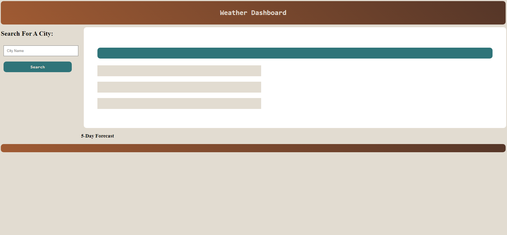

# Weather App
The sixth challenge of my bootcamp

## Description
This weather app is currently in development. 

this weather map is being made to display my knowledge on server side APIs and fetch requests. 

## Useability / Screenshot
Again, this weather app is currently non-functional.

In order to use this website, you would type the name of the city you would like the forecast to. When you click the search button, the website will show the current day's weather, as well as a 5 day future forecast. Your search results will be saved in local Storage. 

## Link
https://RuckusEnjoyer.github.io/Weather-App